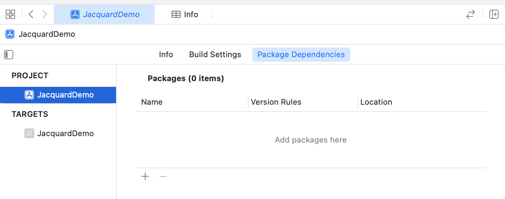
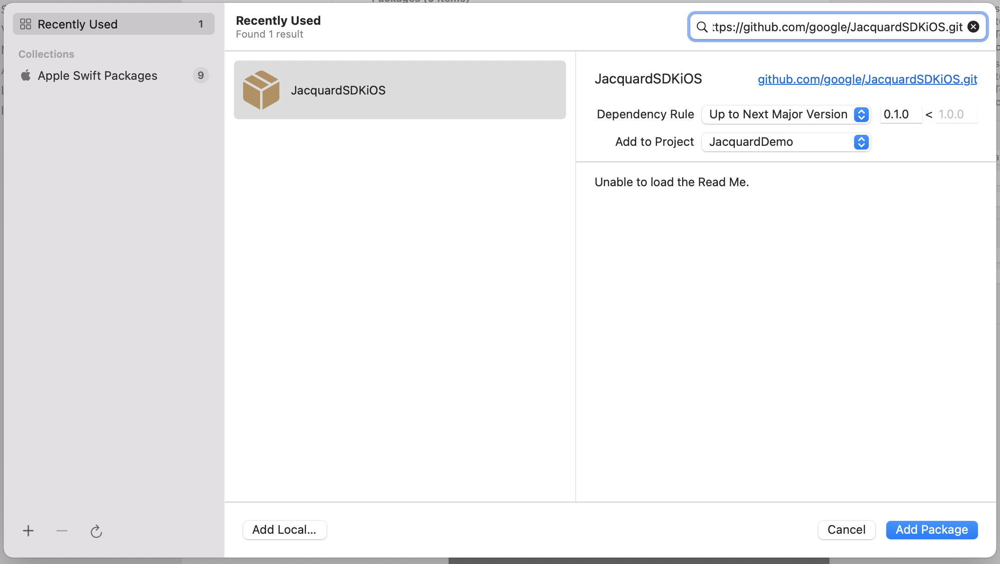

# Integrate JacquardSDK into your Xcode project

## Using CocoaPods

To use CocoaPods to integrate Jacquard's iOS SDK, follow these steps:

1. If cocoapods is not already installed on your Mac
    * Refer Cocoapods [getting started](https://guides.cocoapods.org/using/getting-started.html).

2. If your project does not have a `Podfile`, create one by following below steps:
   * In the terminal, navigate to the directory containing your project's .xcodeproj file.
   * Run this command: `pod init`
   * A file named **Podfile** would be created in the directory.

3. Edit the Podfile:
    * In this file, add  `pod 'JacquardSDK'` to your project's app target.

4.  After this change, your Podfile should look similar to the following:

    ```ruby
    platform :ios, '13.0'

    use_frameworks!

    target '<YOUR_APP_TARGET>' do

      pod 'JacquardSDK'
      
    end
    ```

5. In the terminal, run `pod install`. 
    * If this fails, you may need to update your CocoaPods master spec repository checkout. 
    * Use the command `pod install --repo-update` and follow any instructions.
    
6. Your project directory now has an **.xcworkspace** file.  
    * If your project is already open in Xcode, close it and open the .xcworkspace file. 
    * From now on, you need to use this file to open your project, instead of its .xcodeproj file.

7. To use the Jacquard API's import JacquardSDK wherever necessary, 
     ```swift
     // In AppDelegate.swift or any other file where you're using JacquardSDK
     import JacquardSDK
    ```
    For more on how to use the SDK, follow on with the [tutorial](tutorial.html)


## Swift Package Manager - with Xcode project

If you are using the Swift Package Manager with an Xcode project

1. Navigate to your project settings, where you will see a new menu called Package Dependencies.
2. Click the + button to add JacquardSDK package.
      

3. Enter the repository URL `https://github.com/google/JacquardSDKiOS.git`.
    * As soon as you enter the URL, xcode will find the `JacquardSDKiOS` package. 
    * For the dependancy rule, use the default values : "Up to Next Major Version".
    * Click `Add Package`.
      

4. Check the `JacquardSDK` Library and click `Add Package`.

Xcode will now download all the relevant files and integrate them into your project.

## Swift Package Manager - with Package.swift

If you are using the Swift Package Manager with a `Package.swift`
file, you need to add a dependency to your and import the
`JacquardSDK` library into the desired targets.

```swift
dependencies: [
    .package(name: "JacquardSDK", url: "https://github.com/google/JacquardSDKiOS.git", from: "0.2.0"),
],
targets: [
    .target(name: "MyTarget", dependencies: ["JacquardSDK"]),
]
```
