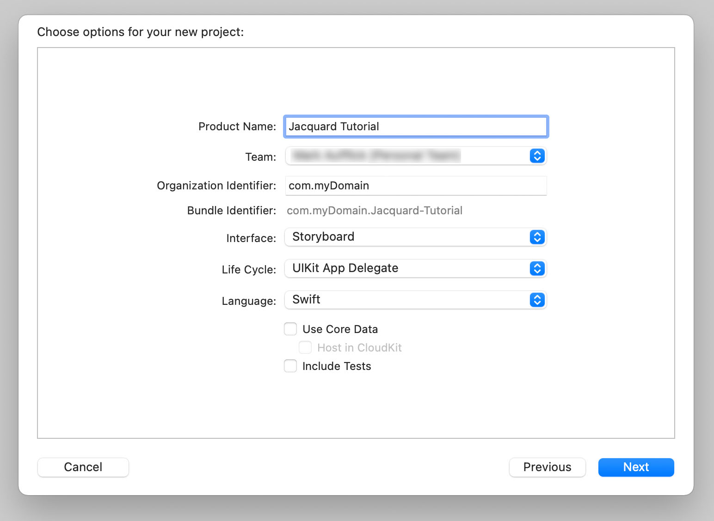
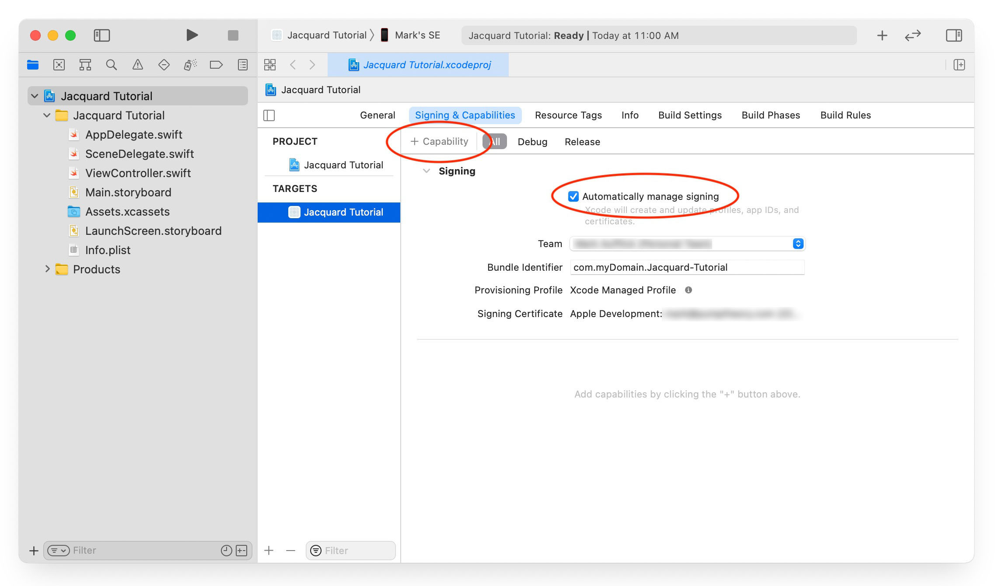
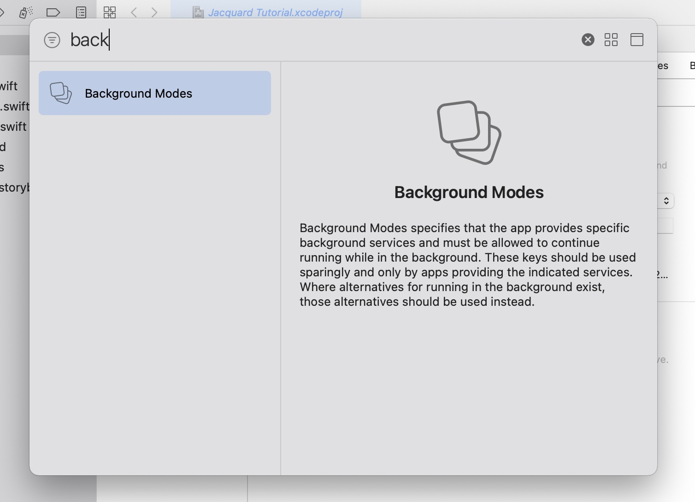
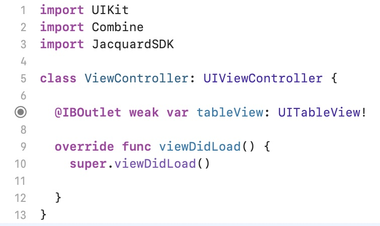
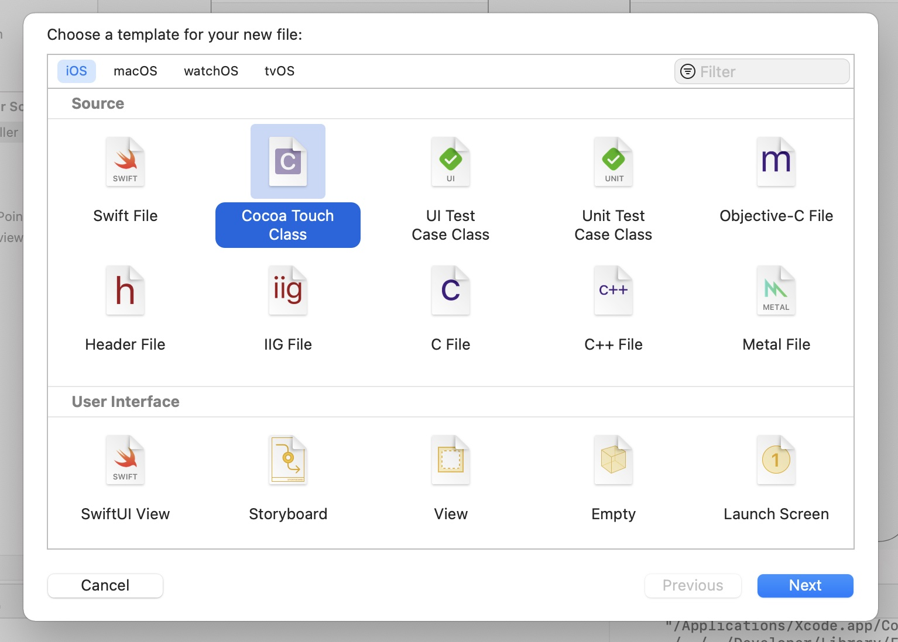
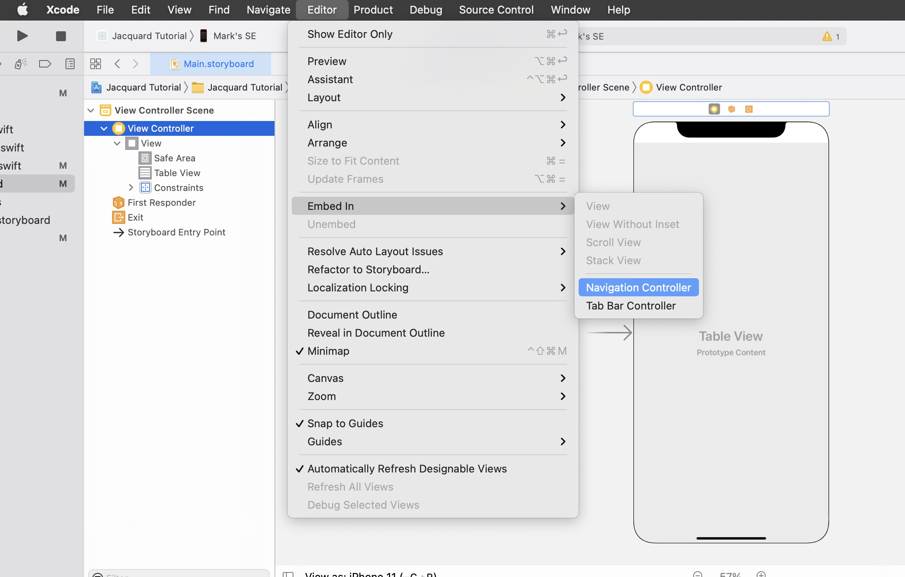
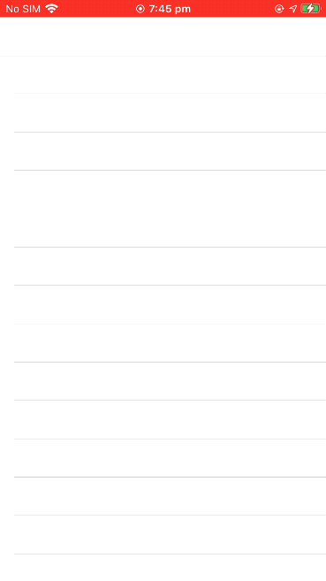

# Tutorial

In this tutorial you will learn how to integrate the Jacquard SDK into
an iOS app, scan and connect to a tag, send commands and respond to
notifications.

You will need:

1. Some Jacquard gear (see [What do I need to get
   started](Getting%20Started.html#what-do-i-need-to-get-started)).
2. An iOS device running iOS 13 or later (since the Jacquard SDK uses
   Bluetooth to connect to your tag the simulator won't work).
3. An Apple developer account (either via the [Apple Developer Program
   or Sign in with your Apple
   ID](https://developer.apple.com/support/compare-memberships/).

This tutorial will describe the following topics to build a basic app
that connects to a Jacquard tag and garment:

1. [Prepare your Jacquard Tag](#1-prepare-your-jacquard-tag)
2. [Create a new Xcode project](#2-create-a-new-xcode-project)
3. [Configure Bluetooth access and signing](#3-configure-bluetooth-access-and-signing)
4. [Integrate Jacquard SDK using Swift Package Manager](#4-integrate-jacquard-sdk-using-swift-package-manager)
5. [Add the scanning table view](#5-add-the-scanning-table-view)
6. [Displaying the advertised tags and connecting the TableView Delegate](#6-displaying-the-advertised-tags-and-connecting-the-tableview-delegate)
7. [Displaying already connected tags](#7-displaying-already-connected-tags)
8. [Adding the second ViewController](#8-adding-the-second-viewcontroller)
9. [Connected tags](#9-connected-tags)
10. [Sending commands](#10-sending-commands)
11. [Observing Notifications](#11-observing-notifications)
12. [Updating Firmwares](#12-updating-firmwares)

## 1. Prepare your Jacquard Tag

> If yo have just opened a new retail Jacquard product, your tag
> probably needs a firmware update (and perhaps charging).
>
> Perform the steps in the [Updating Firmware](updating-firmware.html)
> page before continuing.

Hopefully you have updated your Tag and unlinked the Tag from the Jacquard App. 

In addition to this, to ensure the smoothest path through this tutorial, go
to iOS Bluetooth settings, find the entry for your Jacquard Tag and
choose "Forget this device".


## 2. Create a new Xcode project

In Xcode, create a new iOS **App** project, selecting UIKit and
Storyboard UI.

> File menu -> New -> Project



## 3. Configure Bluetooth access and signing

Since the Jacquard SDK uses Bluetooth to connect to your tag, it is
important to set up signing and entitlements correctly. This setup can
be done in the Target's "Signing and Capabilities" tab. The easiest
way to manage signing and capabilities (assuming you are correctly
logged into your developer account in Xcode's preferences) is to leave
"Automatically manage signing" checked, and then click the "+
Capability" button to find and add the Bluetooth capability.



In the dialog that appears after clicking "+", search for and select
"Background Modes".



Out of the Background modes that appear, check "Uses Bluetooth LE
accessories".


You will also need to add the `NSBluetoothAlwaysUsageDescription` key
to `Info.plist`. Open `Info.plist` in the Project Navigator, and add a
description string with that key.


## 4. Integrate Jacquard SDK using Cocoapods

The easiest way to integrate the Jacquard SDK is using Cocoapods dependency management. 
If you are not familiar with Cocoapods usage and installation, see [these instructions](integration.html).

1. In the terminal, navigate to the directory containing your project's .xcodeproj file.

2. Run this command: `pod init`
    * A file named *Podfile* would be created in the directory.

3. Open the Podfile and make the following three changes:
    * Uncomment the `platform` directive and set to `13.0`:
        ```ruby
        platform :ios, '13.0'
        ```
    * Inside the `target`, add:
        ```ruby
        pod 'JacquardSDK'
        ```
    * Your entire `Podfile` should now look something like this:
        ```ruby
        platform :ios, '13.0'

        target 'Jacquard Tutorial' do
          use_frameworks!
          pod 'JacquardSDK'
        end
        ```
4. Save the podfile, and in terminal run the following command: `pod install`

Xcode will download all the relevant files and integrate them with
your Xcode project. If your project is already open in xcode close it
and open the generated `.xcworkspace` file. (If you get an error
indicating that JacquardSDK could not be found, your CocoaPods cache
may be out of date - try `pod install --repo-update` instead.)

## 5. Add the scanning table view

The app you will make has two screens. The first is a tableview
listing any nearby advertising tags. The second is a screen with a few
simple labels and buttons which you will connect to Jacquard
functions.

First lets set up the Scanning view controller.

1. Select `Main.storyboard` in the Project Navigator
2. Add a table view by
    * opening the Object Library (View menu -> Show Library, or
      Command-Shift-L)
    * find table view, and drag into the view controller.
    * Resize the table view to fill the view controller and add
      appropriate constraints in the usual way.
3. Your storyboard should look something like this: 
4. The one last step to do before you start writing code is to connect
   the table view to an outlet in your view controller.
    * Option-click `ViewController.swift` in the Project Navigator to
      open it alongside the storyboard
    * Control-drag the table view into the ViewController class body
      to create an outlet (call it tableView) 

You're now ready to start coding!

First, `import` two libraries into ViewController.swift, `JacquardSDK`
and `Combine`.

> Keeping app state correct in the face of changing connection
> conditions etc. can be challenging. To make this easier and safer,
> the Jacquard SDK leans heavily on Apple's Combine* Functional
> Reactive Programming framework. You can read more about this
> approach in [API Overview](api-overview.html).

With the `tableView` outlet and these two imports added, your
ViewController.swift should look like this:



> If you see an Xcode error that `JacquardSDK` does not exist, you may
> need to build (Cmd-B) the project once for Xcode to notice the new
> libraries that CocoaPods has added.

The `JacquardManager` protocol (and its concrete implementation,
`JacquardManagerImplementation`) is the entry point to scanning for,
and connecting to, tags. Since for this demo you don't need to supply
a custom queue or any options, creating the manager is as simple as:[^init]

```swift
let jqManager: JacquardManager = JacquardManagerImplementation(publishQueue: .main, options: [:])
```

[^init]: The eagle eyed may notice that it would be simpler to use the
    default arguments. Unfortunately there is currently an issue with
    the way the Swift binary `swiftinterface` file is generated for
    Objective-C ABI classes that means
    `JacquardManagerImplementation()` would compile but generate a
    runtime exception. This will be fixed in the next
    release. [#3](https://github.com/google/JacquardSDKiOS/issues/3).

Add this as a property to the ViewController class.

Since this code will make use of a number of `Combine` publishers, you
need to store references to some `AnyCancellable` instances. Make that
easy with a simple extension, and create an array property in
`ViewController`

```swift
extension AnyCancellable {
  func addTo(_ array: inout [AnyCancellable]) {
    array.append(self)
  }
}

class ViewController: UIViewController {
  var observations = [AnyCancellable] ()
  ...
}
```

This tutorial app will start scanning as soon as possible. If you've
used Apple's `CoreBluetooth` before, you will know that you need to
wait for Bluetooth to become available before that will work. The
Jacquard SDK exposes the state you need as a `Combine` publisher, so
you can start scanning as soon as the state becomes
`.poweredOn`.[^thereIsNoTry] Add this snippet to `viewDidLoad()`:

```swift
    jqManager.centralState.sink { [weak self] state in
      switch state {
      case .poweredOn:
        try! self?.jqManager.startScanning()
        print("Scanning...")
      default:
        break
      }
    }.addTo(&observations)
```

[^thereIsNoTry]: As always, in a real app try to avoid using the
    `try!` force-try.

Once scanning has commenced, any tags that are discovered will be
available, again via a `Combine` publisher, from the `advertisingTag`
var. To check everything is working so far, just print out found
tags. Again, add this to `viewDidLoad()`:

```swift
    jqManager.advertisingTags.sink { advertisedTag in
      print("Found advertising tag \(advertisedTag.displayName)")
    }.addTo(&observations)
```

Before we build and run, check your `ViewController.swift` looks
something like this:

```swift
import UIKit
import Combine
import JacquardSDK

extension AnyCancellable {
  func addTo(_ array: inout [AnyCancellable]) {
    array.append(self)
  }
}

class ViewController: UIViewController {
  var observations = [AnyCancellable] ()

  @IBOutlet weak var tableView: UITableView!

  let jqManager: JacquardManager = JacquardManagerImplementation()

  override func viewDidLoad() {
    super.viewDidLoad()

    jqManager.advertisingTags.sink { advertisedTag in
      print("Found advertising tag \(advertisedTag.displayName)")
    }.addTo(&observations)

    jqManager.centralState.sink { [weak self] state in
      switch state {
      case .poweredOn:
        try! self?.jqManager.startScanning()
        print("Scanning...")
      default:
        break
      }
    }.addTo(&observations)
  }
}
```

Now make sure your real iOS device is plugged in and selected in Xcode
as the run target. Click the Build and Run button, and your device
should show a system dialog saying "Jacquard Tutorial" Would like to
Use Bluetooth. Tap "OK".

You should now see `Scanning...` in your Xcode output (you can ignore
any message about `centralManager:willRestoreState:` for now).

### Put the Jacquard Tag into advertising mode

Press and hold the button on your tag for 3 or 4 seconds (it can be a
little tricky to get right, you should hear and feel a click). The LED
on the tag will start pulsing, and you should see a log entry in Xcode
`Found advertising tag 01ZK` (your tag's identifier will be
different).

## 6. Displaying the advertised tags and connecting the TableView Delegate

Here we are using a standard iOS approach to display the found tag in
a cell and respond to a tapped cell. Here is the full code -
copy/paste to replace the entirety of `ViewController.swift`:

```swift
import UIKit
import Combine
import JacquardSDK

extension AnyCancellable {
  func addTo(_ array: inout [AnyCancellable]) {
    array.append(self)
  }
}

struct TagCellModel: Hashable {
  var tag: ConnectableTag
  static func == (lhs: TagCellModel, rhs: TagCellModel) -> Bool {
    return lhs.tag.identifier == rhs.tag.identifier
  }
  func hash(into hasher: inout Hasher) {
    tag.identifier.hash(into: &hasher)
  }
}
class TagCell: UITableViewCell {
  static let reuseIdentifier = "TagCell"
  func configure(_ tagCellModel: TagCellModel) {
    textLabel?.text = tagCellModel.tag.displayName
  }
}

class ViewController: UIViewController {

  enum Section {
    case advertisedTags
  }

  var observations = [AnyCancellable] ()
  var advertisedTags = [AdvertisedTag]()
  var diffableDataSource: UITableViewDiffableDataSource<Section, TagCellModel>!

  @IBOutlet weak var tableView: UITableView!

  let jqManager: JacquardManager = JacquardManagerImplementation(publishQueue: .main, options: [:])

  override func viewDidLoad() {
    super.viewDidLoad()

    tableView.delegate = self
    tableView.register(TagCell.self, forCellReuseIdentifier: TagCell.reuseIdentifier)

    diffableDataSource = UITableViewDiffableDataSource(tableView: tableView) { (tableView, indexPath, tagModel) -> UITableViewCell? in
      let cell = tableView.dequeueReusableCell(withIdentifier: TagCell.reuseIdentifier, for: indexPath) as! TagCell
      cell.configure(tagModel)
      return cell
    }
    tableView.dataSource = diffableDataSource

    jqManager.advertisingTags.sink { [weak self] advertisedTag in
      print("Found advertising tag \(advertisedTag.displayName)")

      guard let self = self else { return }
      self.advertisedTags.append(advertisedTag)
      self.updateDataSource()
    }.addTo(&observations)

    jqManager.centralState.sink { [weak self] state in
      switch state {
      case .poweredOn:
        try! self?.jqManager.startScanning()
        print("Scanning...")
      default:
        break
      }
    }.addTo(&observations)
  }

  func updateDataSource() {
    let models = self.advertisedTags.map { TagCellModel(tag: $0) }
    var snapshot = NSDiffableDataSourceSnapshot<Section, TagCellModel>()
    snapshot.appendSections([.advertisedTags])
    snapshot.appendItems(models, toSection: .advertisedTags)
    self.diffableDataSource.apply(snapshot)
  }
}

extension ViewController: UITableViewDelegate {
  func tableView(_ tableView: UITableView, didSelectRowAt indexPath: IndexPath) {
    jqManager.stopScanning()

    // Here we will connect to the tag.
  }
}
```

You should be able to build and run and see advertising tags in the
table view (you will need to press and hold the tag button again -
Jacquard tags stop advertising after 60 seconds).

## 7. Displaying already connected tags

When the tag is paired and connected to iOS, it will no longer
advertise. This means we need to use a different mechanism to obtain a
connection object for an already-connected tag. The view controller
will be updated to display those already-connected tags as well as
advertising tags.

Add an instance variable to the view controller to keep a consistent
view of pre-connected tags, and also add a new entry to the `Section`
enum for the table view:

```swift
class ViewController: UIViewController {

  enum Section {
    case advertisedTags
    case preConnectedTags
  }

  var preConnectedTags = [PreConnectedTag]()

  //...
}
```

Like most CoreBluetooth functions, we can't read the list of connected
tags until the `CBCentralState` is `.poweredOn`, so in `viewDidLoad`
we will update the central state observation to also update our list
of tags:

```swift
jqManager.centralState.sink { [weak self] state in
  switch state {
  case .poweredOn:
    guard let self = self else { return }
    self.advertisedTags.append(advertisedTag)
    //
    // *** The following line is added
    //
    self.preConnectedTags = self.jqManager.preConnectedTags()
    // ***
    self.updateDataSource()
    try! self.jqManager.startScanning()
    print("Scanning...")
  default:
    break
  }
}.addTo(&observations)
```

> Note that since reading pre-connected tags from CoreBluetooth is
> synchronous only, this method won't automatically update if a nearby
> tag wakes up and connects while the view is on screen. In a real app
> you may wish to persist a list of known tag UUIDs - the [sample
> app](https://github.com/google/JacquardSDKiOS) is an example of
> doing that.

Finally the `updateDataSource()` method needs to be updated to also
display these tags in a new section:

```swift
  func updateDataSource() {
    let advertisedModels = advertisedTags.map { TagCellModel(tag: $0) }
    let preConnectedModels = preConnectedTags.map { TagCellModel(tag: $0) }
    var snapshot = NSDiffableDataSourceSnapshot<Section, TagCellModel>()
    snapshot.appendSections([.advertisedTags, .preConnectedTags])
    snapshot.appendItems(advertisedModels, toSection: .advertisedTags)
    snapshot.appendItems(preConnectedModels)
    self.diffableDataSource.apply(snapshot)
  }
```

## 8. Adding the second ViewController

First create an empty View Controller class.

1. Right-click on the `Jacquard Tutorial` folder icon in the Project
   Navigator and select `New File...`
1. Select Cocoa Touch Class 
1. Click Next
1. Name the class `ConnectedViewController`, subclass of
   `UIViewController`. 
1. Click Next and save

The storyboard needs the second view controller, but first we need to
embed our first view controller in a `NavigationController`.

1. Return to `Main.storyboard`
1. Select "View Controller"
1. Choose the menu option Editor > Embed in > Navigation Controller
   

Now you can add the second view controller.

1. Using the Object library again (Command-Shift-L), drag a blank
   `UIViewController` onto a blank area in the canvas.
1. Select the new view controller, and in the Inspector, set the class
   to the `ConnectedViewController` class created above.
1. Also set the "Storyboard ID" to `connectedViewController`

Your Storyboard should now look something like this:


We will add some real UI later, but first lets connect the tag and the
view controller together.

## 9. Connected tags

Connecting to tags is an important step that is fully documented in
[Connecting to Tags](Connecting%20to%20Tags.html).

> Sufficient for this tutorial, the `connect()` methods on
> `JacquardManager` return a Combine Publisher which publish a
> sequence of `TagConnectionState` states, including a number of
> pre-connection states, `.connected()` and
> `.disconnected(Error?)`.
> 
> The disconnected state should happen extremely rarely - in normal
> disconnection scenarios (for example the tag goes out of Bluetooth
> range), the `JacquardManager` instance will automatically attempt to
> reconnect, and will (eventually) publish a further `.connected()`
> state. In cases where the tag is near the limit of Bluetooth range,
> it is common for a lot of `.connected()` states to be published in
> relatively quick succession.
> 
> Relying on the Combine Publishers as shown in this tutorial and the
> [sample app](https://github.com/google/JacquardSDKiOS) will ensure
> your app is always using the most recent connected tag instance -
> resist the temptation to store a `ConnectedTag` in an instance
> variable.
>
> One case that is not handled for you is when Bluetooth is turned off
> (and possibly back on). You should observe the other states of
> `jqManager.centralState` to respond to this.

### Using a connected tag

First, let's update `ConnectedViewController` to store the
relevant connection publisher, and set the title by observing the
tag's name. As above, the expected pattern is to interact
with `ConnectedTag` instances always from the connection publisher (to
ensure you are never using a stale/disconnected instance).

Replace the entire contents of `ConnectedViewController.swift` with
the following code block:

```swift
import UIKit
import JacquardSDK
import Combine

class ConnectedViewController: UIViewController {

  var tagConnectionPublisher: AnyPublisher<TagConnectionState, Error>?
  var observations = [AnyCancellable] ()

  override func viewDidLoad() {
    super.viewDidLoad()

    tagConnectionPublisher?.compactMap { connectionState -> ConnectedTag? in
      switch connectionState {
      case .connected(let tag):
        return tag
      default:
        print("Not connected, in connection state: \(connectionState)")
        return nil
      }
    }.flatMap {
      $0.namePublisher
    }.sink(receiveCompletion: { error in
      print("Unrecoverable connection error: \(error)")
    }, receiveValue: { [weak self] name in
      self?.title = name
    }).addTo(&observations)
  }
}
```

This is quite a long chain of Combine operators, and it is common to
want simple access to a connected tag. We will look at tidying this up
later.

### Connecting to the tag

Returning to the original `ViewController.swift` file, we will update
`tableView(_, didSelectRowAt:)` to connect to the selected tag and
present the second view controller.

```swift
extension ViewController: UITableViewDelegate {
  func tableView(_ tableView: UITableView, didSelectRowAt indexPath: IndexPath) {
      jqManager.stopScanning()

    guard let model = diffableDataSource.itemIdentifier(for: indexPath) else {
      return
    }

    guard let nextVC = storyboard?.instantiateViewController(identifier: "connectedViewController")
            as? ConnectedViewController
    else {
      preconditionFailure()
    }
    nextVC.tagConnectionPublisher = jqManager.connect(model.tag)
    navigationController?.pushViewController(nextVC, animated: true)
  }
}
```

Congratulations, your app will now show an advertising tag, connect to
it, and set the view controller title. Try it now (and don't forget to
press the tag's button for four seconds to restart pairing mode).



## 10. Sending commands

Now we'll explore sending commands to the tag, in this case
`PlayLEDPatternCommand` (commands are documented in the
[Commands](Commands.html) documentation).

But first, lets tidy up that long Combine operator chain by creating a
simpler publisher. Normally we're only interested in getting access to
the latest `ConnectedTag`. Sometimes we want to keep observing the
latest (such as above where any name updates will continue to update
the View Controller title even after reconnections). Often we want
just the current or next connected tag for a one-time use (such as to
play an LED pattern). We can use Combine operators to easily achieve
both.

When the `tagConnectionPublisher` instance variable is set in
`ConnectedViewController.swift`, we will also create the derived
publishers we want. Switch to `ConnectedViewController.swift`, add
a `tagPublisher` property and set it by adding a `didSet` observer:

```swift
  var tagPublisher: AnyPublisher<ConnectedTag, Never>?
  var tagConnectionPublisher: AnyPublisher<TagConnectionState, Error>? {
    didSet {
      tagPublisher = tagConnectionPublisher?
        .catch {
          // Connection failures will be handled elsewhere.
          Just<TagConnectionState>(TagConnectionState.disconnected($0))
        }.compactMap { connectionState -> ConnectedTag? in
          switch connectionState {
          case .connected(let tag):
            return tag
          default:
            print("Not connected, in connection state: \(connectionState)")
            return nil
          }
        }.eraseToAnyPublisher()
    }
  }
```

For any functionality where knowing the precise state of connection is
important (for example displaying connection status, or enabling UI),
the `tagConnectionPublisher` can be used. For most common cases the
simpler `tagPublisher` can be used. Let's change our title update code
to use this new publisher.

```swift
  override func viewDidLoad() {
    super.viewDidLoad()
    
    tagPublisher?
      .flatMap { $0.namePublisher }
      .sink { [weak self] name in self?.title = name  }
      .addTo(&observations)
  }
```

Much tidier. Now lets add a button to send an LED command to the tag
(some Jacquard garments also have LEDs which can be addressed
independently, but here we will use the tag's built-in LED).

### Adding the button

1. Edit `Main.storyboard` again
1. Drag a UIButton from the Object Library onto "Connected View Controller"
1. Set the button's title to "Play LED Pattern"
1. Apply constraints to locate the button wherever you wish
1. Option-click `ConnectedViewController.swift` in the project
   navigator to open it alongside the storyboard, and control-drag
   from the button to create a target/action method 
1. Name the method `playLEDTap`

Sending a command to a tag has three phases, constructing the command
request instance, sending it to the tag, and finally waiting for the
response (or error).

Like all other asynchronous tasks in the Jacquard SDK, sending
commands creates a Combine publisher. Some commands publish a return
value (like `BatteryStatusCommand`), others like `PlayLEDCommand`
publish `Void` for success, or may fail with an error. Sending the
command is achieved using the `enqueue(_:retries:)` method on
`ConnectedTag`.

Some commands, as in this case, require a `Component` argument. They
are documented more thoroughly in the [Components](Components%20and%20Gear.html)
documentation, but in essence a `Component` represents a currently
connected piece of Jacquard gear. The tag has a built-in `Component`
(which is always available) and Jacquard gear (like a jacket or
backpack) may be connected to the tag. Each component has different
capabilities (which you can introspect using the `capabilities`
method), but we know that the tag's built-in component always has an
LED.

Your `playLEDTap` method should look something like:

```swift
  @IBAction func playLEDTap(_ sender: Any) {
    let blue = PlayLEDPatternCommand.Color(red: 0, green: 0, blue: 255)
    let red = PlayLEDPatternCommand.Color(red: 255, green: 0, blue: 0)
    let yellow = PlayLEDPatternCommand.Color(red: 255, green: 255, blue: 0)
    let green = PlayLEDPatternCommand.Color(red: 0, green: 255, blue: 0)
    let off = PlayLEDPatternCommand.Color(red: 0, green: 0, blue: 0)

    let frames = [blue, red, yellow, blue, green, red, off].map {
      PlayLEDPatternCommand.Frame(color: $0, durationMs: 250)
    }

    tagPublisher?
      .prefix(1)
      .flatMap { tag -> AnyPublisher<Void, Error> in
        let commandRequest = try! PlayLEDPatternCommand(
          frames: frames,
          durationMs: 6000,
          component: tag.tagComponent)
        return tag.enqueue(commandRequest)
      }.sink(receiveCompletion: { error in
        print("Failed to play LED pattern: \(error)")
      }, receiveValue: {
        print("Played LED pattern successfully")
      }).addTo(&observations)
  }
```

The `.prefix(1)` operator is important here. It means take the first
connected tag and then stop. If we didn't apply that here, then if the
tag disconnected and reconnected, the led pattern would be played
again!

Try building and running your app - you should be able to make the LED
play this pattern.

## 11. Observing Notifications

Commands are initiated by the app and sent to the tag (possibly with a
response). Notifications on the other hand originate from the tag at
any time. As you may have guessed, notification subscriptions come in
the form of a Combine publisher.

> Instead of using the `ConnectedTag` instance directly, there is a
> small extra step to get a `SubscribableTag`. This is an important
> part of how State Restoration is handled, which is explained in the
> `ConnectedTag` documentation.

First add a method to `ConnectedViewContrller` which will do something
useful with a gesture notification. In this case we will define
"useful" to mean printing out to the console:

```swift
  func createSubscriptions(_ tag: SubscribableTag) {
    let gestureNotificationRequest = GestureNotificationSubscription()
    tag.subscribe(gestureNotificationRequest)
      .sink { gesture in
        print("Observed gesture: \(gesture)")
      }.addTo(&observations)
  }
```

Now call this method with a `SubscribableTag` instance whenever the
tag connects or reconnects. Place this code in the `viewDidLoad()`
method of `ConnectedViewController`:

```swift
    tagPublisher?
      .sink { [weak self] tag in
        guard let self = self else { return }
        tag.registerSubscriptions(self.createSubscriptions)
      }.addTo(&observations)
```

This is the final build and run for this tutorial. Once you have
connected to the tag again, insert the tag into your Jacquard gear and
perform a brush, double tap or other gesture and you will see the
gesture logged into the Xcode console.

You have now successfully integrated the Jacquard SDK and learned how
to connect, send commands and observe notifications. There's more to
the SDK which you can see demonstrated in the [sample
app](https://github.com/google/JacquardDSKiOS) and read about in the
SDK documentation (see the table of contents on the left side of this
page).

## 12. Updating Firmwares
Before using any Jacquard SDK core api, it is always recommended to ensure that you have the latest
available firmware. After your tag is paired, next ideal step should be to check for firmware update
by calling Jacquard SDK firmware api's which are backed up by Jacquard cloud.
Updating firmware is a 3 step process -

#### 1. Check if update available
This step would need internet connectivity as it calls Jacquard cloud api to see if any firmware
updates are available. If updates are available for your current firmware, sdk will start downloading firmware
binary implicitly. Updates can be of 2 types.

1. Mandatory - Firmware update is required.
2. Optional - Firmware update is optional and can be skipped.
3. None - If there is no updates available.

#### 2. Apply updates
Jacquard sdk will transfer downloaded firmware binary to the tag using bluetooth connection.
This step might take a while depending on the size of downloaded firmware binary.

#### 3. Execute updates
In this step, Jacquard sdk will install the firmware binary on the tag. You can skip this step by passing
`shouldAutoExecute=true` in Apply updates (Step 2).

The control for executing the installation is provided as a separate API, because the Tag will reboot after
installation, As a general practice, you should inform the users that this will happen.

Note: This step is not required in case of loadable module.

 Let's start with the implementation. It's pretty much straight forward.

#### Update tag / interposer firmware

 ##### 1. Check if update available -

 To check if update is available for both tag and interposer, insert your tag into your gear and use below piece of
 code -

```swift
tag.firmwareUpdateManager.checkUpdates(forceCheck: false)
  .sink { completion in
    if case .failure(let error) = completion {
      print("Firmware update error: \(error)")
    }
  } receiveValue: { updates in
    print("Available firmware updates: \(updates)")
  }.addTo(&observers)
```

This code will return an array of <code>DFUUpdateInfo</code> for each input component. Check the value for
`DFUUpdateInfo.dfuStatus` to know what type of firmware update is available. It could be either
`mandatory` or `optional` or `none`. `forceCheck` boolean is used by the sdk to decide if data would be retrieved
from cloud or cached info should be returned.

It's advised to use `forceCheck` as `false`, because it allows SDK to decide the best source of information.

##### 2. Apply updates -

Here, Jacquard sdk will transfer downloaded firmware binary from mobile to the tag. You need to use an array of
`DFUUpdateInfo` which you have received in previous step.

```swift
tag.firmwareUpdateManager.applyUpdates(updates, shouldAutoExecute: true)
  .sink { state in
    switch state {
    case .idle: break
    case .preparingForTransfer: break
    case .transferring(let progress):
      print(progress)
    case .transferred: break
    case .executing: break
    case .completed: break
    case .error(let error):
      print(error)
    }
  }.addTo(&observers)
```

`FirmwareUpdateState` will give you the exact status of the operation. When Jacquard sdk
starts transferring firmware binary to the tag. i.e. state is `transferring`, you can track the
transfer progress using below code:

```swift
switch state {
case .transferring(let progress):
  print(progress)
}
```

You can use `shouldAutoExecute=true` to install the updates automatically, otherwise you will need to call
`executeUpdates()` api explicitly after when state is changed to `transferred`.

`FirwareUpdateState.error()` will give you the error occurred in this step.

##### 3. Execute updates -

This is the last step in firmware update in which Jacquard sdk instructs tag to install the firmware
binary transferred in previous step. This step is not required if you are sending `shouldAutoExecute=true`
in `applyUpdates()` api. If you are updating tag firmware, tag will reboot during this step.

```swift
tag.firmwareUpdateManager.executeUpdates()
```

`FirmwareUpdateState` returned by this api can either be `executing` or `completed`.
