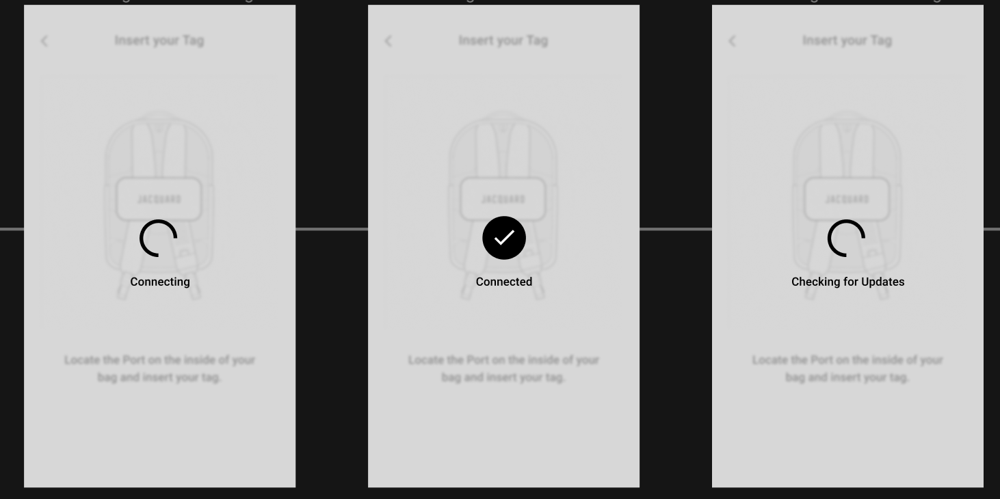
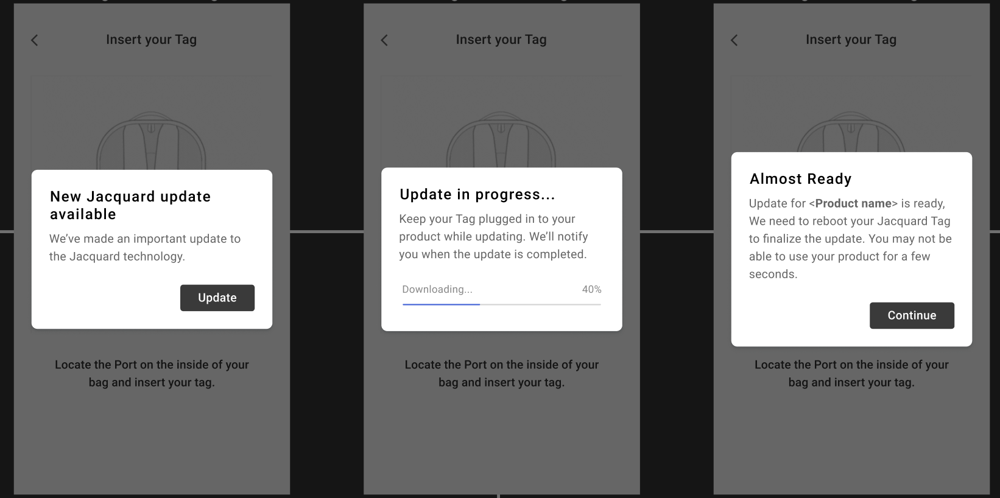
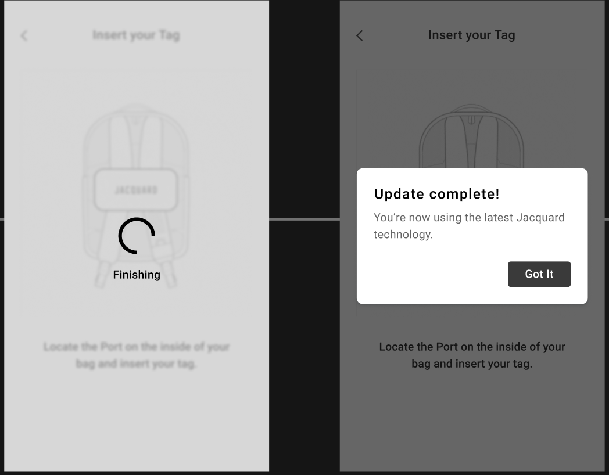
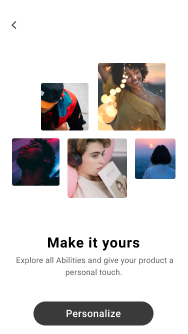
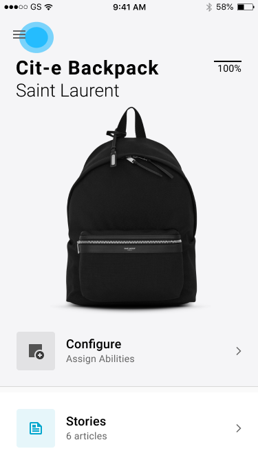
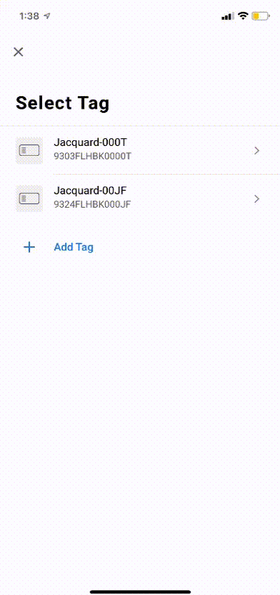

# Update your Jacquard tag

If you have just bought your Jacquard product and using it out of the
box, your tag requires a firmware update.

## Recommended firmware update method

Once you have set a valid API key in the `SDKConfig` instance used to
initialize `JacquardManagerImplementation` (see [this
page](cloud-api-terms.html) for details on obtaining an API Key) the
SDK will apply any required firmware updates when your tag connects.

## Alternative firmware update method

Alternatively, you can use the Jacquard iOS app in the App Store to
update your tag's firmware using the instructions below.

### What you need to get started

To set up your Jacquard Tag, you need:

1. Your Jacquard product and accompanying Jacquard Tag
2. A supported iOS mobile phone

> You need an iPhone 6® or newer running iOS 13 or newer.

3. Latest version of the Jacquard app

> Download from [here](https://apps.apple.com/us/app/jacquard-by-google/id1204971157).

4. A Google Account
5. An internet connection
6. Bluetooth enabled on your mobile phone

### Steps

1. Install the Jacquard app by visiting the [App Store](https://apps.apple.com/us/app/jacquard-by-google/id1204971157).
2. Open the Jacquard app. Tap Get Started.
3. Choose or add the Google Account you want to link to Jacquard. Tap NEXT. 
4. Tap Agree to accept the Terms of Service and Privacy Policy. 
5. You will see a screen that lets you choose how you want to be notified. Tap Agree after selecting. 
6. Select your specific Jacquard item. 
7. To pair your Jacquard Tag, press and hold the button on the right side of the Tag for three seconds. 
8. Once the Tag is identified, select the serial number in the app that matches the last 4 digits of the number on the back of your Tag. 
9. Tap Pair. 
10. To allow Bluetooth pairing, tap Pair. 
11. Insert your Tag in the port on your Jacquard item. 
12. At this moment the Jacquard app will check if a firmware update is needed.

13. If an update is available you will be prompted with a dialog, Tap Update.
14. Jacquard app will update the Tag firmware and show the progress on screen.
15. Once download is complete, it will prompt to reboot the tag. Tap Continue.

16. Within 10 seconds Jacuard app should reconnect and infrom that the update was succesfull.

17. Your Jacquard item is now active. Tap Next. 
18. Go through an interactive tutorial of Jacquard gestures.
19. You have completed the Firmware update process. Tap Personalize

> The firmware update process is now complete, but before continuing with the tutorial it's important to 
"forget/unlink" the tag in the Jacquard app, This is because the current tag BLE protocol does not support simultaneous connections from two apps. 
Read on to learn how you can unlink the Tag.

### Forget/Unlink Tag from Jacquard app

To use your Jacquard product with the SDK or sample app, you must forget the tag from Jacquard app. 

#### Steps

1. Open the Jacquard app .
2. Tap Menu  button in the top left corner of the home screen.
 
3. From the list of options, Tap Jacquard Tag.
4. The easiest way to forget the tag is to do a `swipe right to delete` :
 

> The Firmware update and Tag unlinking process is now complete you can go back to the [Tutorial](tutorial.html)

